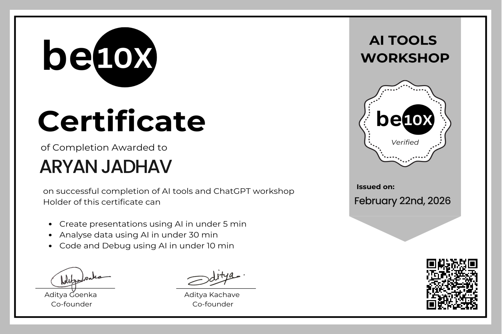

# Aryan Santosh Jadhav - Portfolio Website

A modern, minimalistic portfolio website showcasing professional achievements, projects, and experience.

## 📋 Features

✨ **Modern Design** - Clean and minimalistic interface with light blue and white color scheme
📱 **Fully Responsive** - Works perfectly on desktop, tablet, and mobile devices
🎴 **Certificate Slideshow** - Interactive slideshow to display certificates and achievements
🧭 **Smooth Navigation** - Sticky navigation bar with smooth scrolling
⚡ **Fast & Optimized** - Lightweight HTML, CSS, and JavaScript

## 📁 Folder Structure

```
portfolio/
├── index.html           # Main portfolio page
├── style.css           # Styling (light blue & white theme)
├── script.js           # JavaScript for interactive features
├── README.md           # This file
├── certificates/       # 📁 Add your certificate images here
│   ├── certificate1.jpg
│   ├── certificate2.jpg
│   └── certificate3.jpg
└── assets/            # 📁 Profile photo and other media
    ├── profile-photo.jpg
    └── resume.pdf
```

## 🚀 Getting Started

### Step 1: Add Your Profile Photo
1. Place your profile photo in the `assets/` folder
2. Name it `profile-photo.jpg` (or update the filename in `index.html`)

### Step 2: Add Your Certificates
1. Place your certificate images in the `certificates/` folder
2. Name them `certificate1.jpg`, `certificate2.jpg`, `certificate3.jpg`, etc.
3. If you add/remove certificates, update the slides and dots in `index.html`

### Step 3: Add Your Resume
1. Place your resume PDF in the `assets/` folder
2. Name it `resume.pdf` (or update the filename in `index.html`)

### Step 4: Deploy

#### Option A: GitHub Pages (Free)
1. Go to your repository settings
2. Scroll to "GitHub Pages"
3. Set source to `main` branch
4. Your site will be live at `https://Aryan4297.github.io/portfolio/`

#### Option B: Vercel (Recommended)
1. Go to [vercel.com](https://vercel.com)
2. Sign up with GitHub
3. Import your repository
4. Vercel will auto-deploy and provide a URL

#### Option C: Netlify
1. Go to [netlify.com](https://netlify.com)
2. Click "New site from Git"
3. Select your repository
4. Deploy

## 🎨 Customization

### Colors
Edit the `:root` color variables in `style.css`:
```css
:root {
    --primary-color: #E3F2FD;      /* Light Blue */
    --primary-darker: #2196F3;     /* Dark Blue */
    --white: #FFFFFF;
    --text-color: #333333;
}
```

### Fonts
Change the font-family in the `body` selector in `style.css`

### Content
Edit the text and information directly in `index.html`

## 🖼️ Adding More Certificates

To add more certificate slides:

1. **Add HTML slide** in the `slideshow-container` div:
```html
<div class="slide fade">
    
</div>
```

2. **Add dot indicator**:
```html
<span class="dot" onclick="currentSlide(4)"></span>
```

## 📊 Sections Included

- **Hero** - Profile photo, name, and CTA buttons
- **About** - Professional summary and contact info
- **Experience** - Work experience timeline
- **Skills** - Technical and soft skills
- **Certificates** - Interactive slideshow for achievements
- **Education** - Educational background
- **Languages** - Languages spoken
- **Contact** - Contact methods and CTA

## 🔧 Browser Support

- Chrome (latest)
- Firefox (latest)
- Safari (latest)
- Edge (latest)
- Mobile browsers

## 📝 License

Feel free to use this portfolio template for personal use.

## 💡 Tips

- Keep image file sizes under 500KB for faster loading
- Use high-quality photos (at least 1200x1200px for profile photo)
- Test on mobile devices using browser DevTools
- Update the footer year periodically

## 🤝 Need Help?

If you need to modify anything, feel free to reach out!

---

**Last Updated:** June 2026
**Created by:** Aryan Santosh Jadhav
